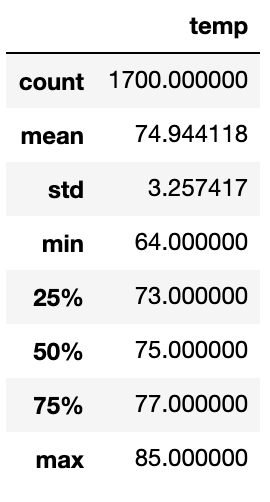
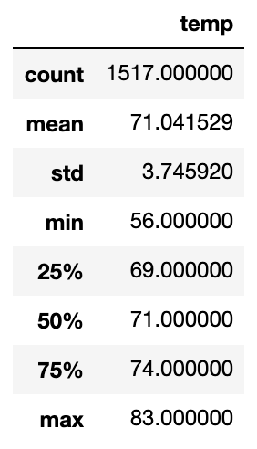

# surfs_up

## Overview
Our prospective investor for the surf shop and ice cream parlor has requested additional weather statistics from us.  Specifically, the investor requested an analysis pertaining to weather trends in the months of June and December.  This will help us to understand the consumer demand for our products during these two months, which are typically the slower months of the season.  If the weather conditions are acceptable during these months then the success of the shop may be acceptable to invest in.

## Results

### June
For June we were able to analyze 1,700 data points.  The average temperature during this time was 74.9 degrees with only 25% of the data points falling below 70 degrees.  The minimum temperature during this time was 64 degrees

	

### December
For December we were able to analyze 1,517 data points.  The average temperature during this time was 71.0 degrees with 50% of the data points falling below 71 degrees.  The minimum temperature during this time was 56 degrees

	

## Summary
Based on the weather conditions June will be a prime month for surfing.  December would be a slower month but many of the "die hard" visitors that come to Hawaii for surfing will still utilize our services.  With success of the shop will depend on managing the swings in the business as every business has seasonality.  In addition to the temperature data a review of the precipitation data would also be beneficial.  I refactured the code used to gather the temperature data to gather precipitation information.  Based on those new queries the month of June also has a lot less precipitation than in December (mean of .13 in June compared to .21 in December)
